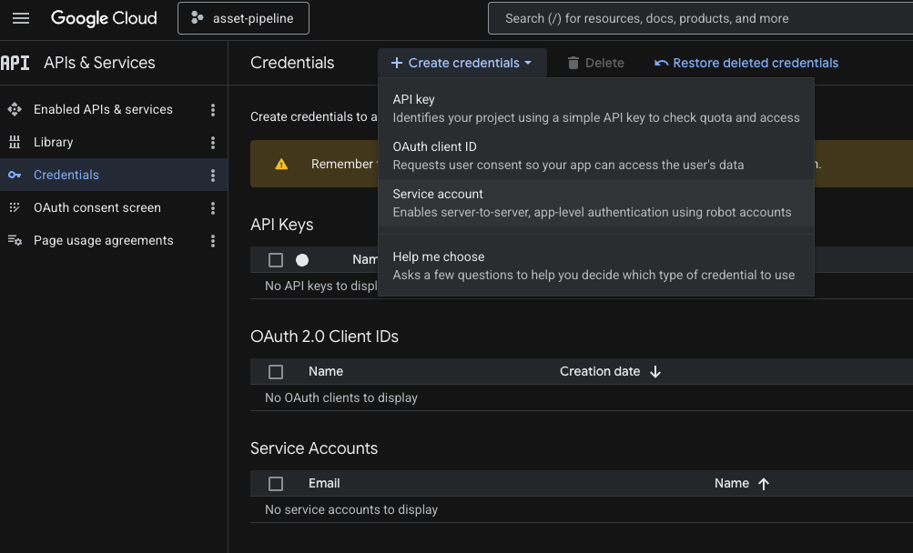
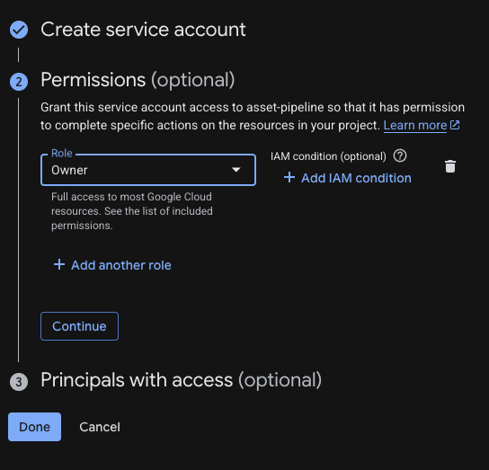
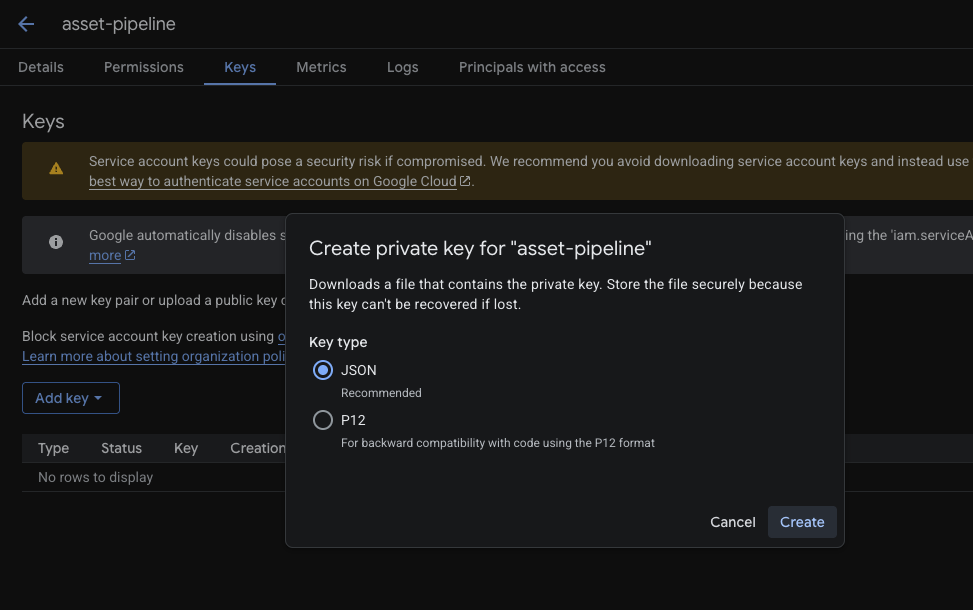

# Asset Optimization Pipeline

A local, single-user pipeline for managing and optimizing product assets. It reads a master product list from Google Sheets, audits asset folders in Google Drive, applies bulk fixes, and publishes canonical files to S3.

---

## Table of Contents

- [Overview](#overview)
- [Architecture](#architecture)
- [Prerequisites](#prerequisites)
- [Installation](#installation)
- [Configuration](#configuration)
  - [Environment variables](#environment-variables)
  - [Pipeline config](#pipeline-config)
  - [Google service account](#google-service-account)
- [Google Drive folder structure](#google-drive-folder-structure)
- [CLI reference](#cli-reference)
  - [`asset init`](#asset-init)
  - [`asset diagnose`](#asset-diagnose)
  - [`asset rename-lifestyle-photos`](#asset-rename-lifestyle-photos)
- [Pipeline stages](#pipeline-stages)
- [Development](#development)
  - [Project layout](#project-layout)
  - [Common make targets](#common-make-targets)
  - [Running tests](#running-tests)
  - [Adding a migration](#adding-a-migration)

---

## Overview

The pipeline works against two sources of truth:

| Source | What it owns |
|--------|-------------|
| **Google Sheets** | Which products exist (SKUs, suppliers, metadata) |
| **Google Drive** | Which asset files exist and their folder structure |

A typical run moves through several stages — pulling the product list, scanning Drive, diagnosing problems, applying fixes, and publishing — each of which can be run independently from the CLI.

---

## Architecture

```
asset_pipeline/
├── packages/
│   ├── db/       Python package — SQLAlchemy models + Alembic migrations
│   └── sdk/      Python package — storage adapters, stage logic, config
├── apps/
│   ├── cli/      Typer CLI  (entry point: `asset`)
│   ├── api/      FastAPI service  (read-only views, v2)
│   └── web/      Next.js 15 front-end  (v2)
├── pipeline.config.toml   Per-project standards (folder names, image rules)
└── docker-compose.yml     Local Postgres 16
```

Python packages are tied together with a **uv workspace**. The JS app is managed by **pnpm + Turborepo**.

---

## Prerequisites

| Tool | Version | Install |
|------|---------|---------|
| Python | 3.12+ | [python.org](https://www.python.org/downloads/) or `brew install python` |
| uv | latest | See below |
| Node.js | 20+ | [nodejs.org](https://nodejs.org/) or `brew install node` |
| pnpm | 9+ | See below |
| Docker Desktop | any recent | [docker.com](https://www.docker.com/products/docker-desktop/) |

---

## Installation

### 1. Install uv

uv is the Python package manager used by this project.

```bash
# macOS / Linux (recommended)
curl -LsSf https://astral.sh/uv/install.sh | sh

# macOS via Homebrew
brew install uv
```

After installing, reload your shell:

```bash
source ~/.zshrc   # or ~/.bashrc / ~/.bash_profile depending on your shell
```

Verify:

```bash
uv --version
```

### 2. Install pnpm

pnpm manages the Node.js dependencies (web app).

```bash
# macOS / Linux
curl -fsSL https://get.pnpm.io/install.sh | sh

# macOS via Homebrew
brew install pnpm

# via npm (if you already have Node)
npm install -g pnpm
```

Verify:

```bash
pnpm --version
```

### 3. Clone and set up the project

```bash
# Clone the repo
git clone <repo-url>
cd asset_pipeline

# Copy and fill in the environment file
cp env.example .env
# Edit .env — see the Configuration section below for required values.

# Install all Python and JS dependencies
make install

# Start Postgres and run migrations
make up
make migrate
```

After `make install` the `asset` CLI is available inside the uv environment:

```bash
uv run asset --help
```

---

## Configuration

### Environment variables

Copy `env.example` to `.env` and fill in the values. The file is gitignored.

| Variable | Required | Description |
|----------|----------|-------------|
| `DATABASE_URL` | Yes | Postgres connection string. Defaults to the local Docker instance. |
| `GOOGLE_APPLICATION_CREDENTIALS` | Yes | Path to a Google service account JSON key file (see [Google service account](#google-service-account)). |
| `GOOGLE_SHEETS_MASTER_ID` | Yes | ID of the Google Sheet that holds the master product list. Found in the sheet URL: `https://docs.google.com/spreadsheets/d/**<ID>**/`. |
| `GOOGLE_DRIVE_ROOT_FOLDER_ID` | Yes | ID of the Google Drive folder that contains all SKU folders. Found in the folder URL: `https://drive.google.com/drive/folders/**<ID>**`. |
| `GOOGLE_DRIVE_LIFESTYLE_FOLDER_ID` | For `rename-lifestyle-photos` | ID of the Google Drive folder containing the lifestyle photo folders (named by parent product). |
| `GOOGLE_SHEETS_RANGE` | No | Default read range, e.g. `Products!A1:Z10000`. |
| `AWS_REGION` | No | AWS region for S3 publishing (used in future stages). |
| `AWS_ACCESS_KEY_ID` | No | AWS credentials for S3. |
| `AWS_SECRET_ACCESS_KEY` | No | AWS credentials for S3. |
| `S3_BUCKET` | No | Destination S3 bucket. |
| `S3_PREFIX` | No | Key prefix inside the bucket. |
| `PIPELINE_CONFIG_PATH` | No | Path to `pipeline.config.toml`. Defaults to `./pipeline.config.toml`. |
| `LOG_LEVEL` | No | `INFO` (default), `DEBUG`, `WARNING`, etc. |

### Pipeline config

`pipeline.config.toml` controls the folder naming convention and per-kind quality standards used by the diagnose and remediate stages.

```toml
[csv]
tab_name        = "products"       # sheet tab that contains the SKU list
sku_column      = "sku"            # column A header
supplier_column = "supplier"       # column E header

[drive]
# "supplier" → root / <supplier> / <sku>   (default)
# "flat"     → root / <sku>
structure = "supplier"

[diagnose]
report_tab = "Diagnose Report"     # tab written back to the sheet

[paths.input]
# Subfolder names expected inside every SKU folder in Google Drive.
product_photos        = "product_photos"
lifestyle_photos      = "lifestyle_photos"
thumbnails_website    = "thumbnails/website_thumbnail"
thumbnails_system     = "thumbnails/system_thumbnail"
videos                = "videos"
diagram               = "diagram"
models_dwg            = "models/dwg"
models_obj            = "models/obj"
models_gltf           = "models/gltf"
models_skp            = "models/skp"
assembly_instructions = "assembly_instructions"
carton_layout         = "carton_layout"
barcode               = "barcode"
```

To rename a folder, update the value here — no code changes needed.

### Google service account

The pipeline authenticates to Google using a **service account** — a bot identity that can be granted access to specific Sheets and Drive folders without using your personal Google account.

#### Step 1 — Create a Google Cloud project (skip if you already have one)

1. Go to [console.cloud.google.com](https://console.cloud.google.com/).
2. Click the project dropdown at the top → **New Project**.
3. Give it a name (e.g. `asset-pipeline`) and click **Create**.

#### Step 2 — Enable the required APIs

1. In the left sidebar go to **APIs & Services → Library**.
2. Search for and enable each of these:
   - **Google Sheets API**
   - **Google Drive API**

#### Step 3 — Create a service account

1. In the left sidebar go to **APIs & Services → Credentials**.
2. Click **+ Create credentials** at the top and choose **Service account** from the dropdown.



3. Fill in a name (e.g. `asset-pipeline`) and click **Create and continue**.
4. On the **Permissions** step, set the role to **Owner** and click **Continue**.



5. Skip the **Principals with access** step and click **Done**.

#### Step 4 — Generate a JSON key

1. On the Credentials page, find your new service account under the **Service Accounts** section and click on it.
2. Go to the **Keys** tab → **Add key → Create new key**.
3. Select **JSON** (recommended) and click **Create**.



4. The JSON key file downloads automatically to your computer.

#### Step 5 — Save the key to the project

```bash
mkdir -p .secrets
mv ~/Downloads/<your-key-file>.json .secrets/google-service-account.json
```

The `.secrets/` directory is gitignored — the key will never be committed.

#### Step 6 — Share access with the service account

The service account has an email address that looks like:

```
asset-pipeline@<your-project-id>.iam.gserviceaccount.com
```

You can find it on the Credentials page under **Service Accounts**.

Share the following resources with that email:

| Resource | Access level | Why |
|----------|-------------|-----|
| Your Google Sheet | **Editor** | The pipeline writes report tabs back to the sheet |
| Your Google Drive root folder | **Viewer** | The pipeline lists folders and counts files |

To share the Sheet: open it → click **Share** → paste the service account email → set role to Editor.

To share the Drive folder: right-click the folder in Drive → **Share** → paste the email → set role to Viewer.

#### Step 7 — Configure `.env`

Make sure your `.env` contains:

```bash
GOOGLE_APPLICATION_CREDENTIALS=./.secrets/google-service-account.json
GOOGLE_SHEETS_MASTER_ID=<your-sheet-id>
GOOGLE_DRIVE_ROOT_FOLDER_ID=<your-drive-folder-id>
```

#### Step 8 — Verify

```bash
uv run asset init
```

You should see a green checkmark for both the Sheet and the Drive folder.

---

## Google Drive folder structure

The pipeline expects the Drive root folder (set via `GOOGLE_DRIVE_ROOT_FOLDER_ID`) to be organised by supplier, with one subfolder per supplier and one subfolder per SKU inside each supplier:

```
<Drive root folder>/
└── <Supplier>/
    └── <SKU>/
        ├── product_photos/
        ├── lifestyle_photos/
        ├── thumbnails/
        │   ├── website_thumbnail/
        │   └── system_thumbnail/
        ├── videos/
        ├── diagram/
        ├── models/
        │   ├── dwg/
        │   ├── obj/
        │   ├── gltf/
        │   └── skp/
        ├── assembly_instructions/
        ├── carton_layout/
        └── barcode/
```

SKU folder names must match the SKU values in the master Google Sheet exactly. The subfolder names are configured in `pipeline.config.toml` and can be changed there without touching any code.

---

## CLI reference

All commands are run via `uv run asset <command>` from the repo root, or just `asset <command>` if the virtual environment is activated.

```bash
uv run asset --help
```

---

### `asset init`

Verifies that credentials are working and that both Google resources are reachable. Run this first whenever you set up the project or rotate credentials.

**Usage:**

```bash
uv run asset init
# IDs are read from GOOGLE_SHEETS_MASTER_ID and GOOGLE_DRIVE_ROOT_FOLDER_ID in .env
```

**Example output (success):**

```
Checking Google credentials and resource access…

✓ Google Sheet found:  Product Master
    ID: 1BxiMVs0XRA5nFMdKvBdBZjgmUUqptlbs74OgVE2upms

✓ Drive folder found:  Products
    ID: 1a2b3c4d5e6f7g8h9i0j
```

**Example output (failure):**

```
Checking Google credentials and resource access…

✗ Google Sheet not accessible: <HttpError 403 "The caller does not have permission">

✗ Drive folder not accessible: <HttpError 404 "File not found: 1a2b3c4d5e6f7g8h9i0j">
```

Common causes of failure:
- `GOOGLE_APPLICATION_CREDENTIALS` points to a file that doesn't exist or is not a valid JSON key.
- The service account email has not been shared on the Sheet or Drive folder.
- The Sheet ID or Drive folder ID in `.env` is incorrect.

---

### `asset diagnose`

Compares the Google Drive products folder against the master Google Sheet and writes a structured report back into the sheet as a new tab.

**What it checks:**

- Every SKU in the sheet has a matching folder in Google Drive.
- No folders exist in Drive that are not listed in the sheet (orphan folders).
- Every SKU folder contains all expected subfolders.
- File count inside each subfolder for every SKU.

Most options are read automatically from `pipeline.config.toml` — in normal use you only need to run:

```bash
uv run asset diagnose
```

**Usage:**

```bash
uv run asset diagnose \
  [--folder-id <drive-folder-id>] \
  [--sheet-id <google-sheets-id>] \
  [--tab <sheet-tab>] \
  [--sku-col <header>] \
  [--supplier-col <header>] \
  [--report-tab <tab-name>] \
  [--config-path pipeline.config.toml]
```

**Options:**

| Option | Default | Description |
|--------|---------|-------------|
| `--folder-id` | `$GOOGLE_DRIVE_ROOT_FOLDER_ID` | Google Drive root folder ID. |
| `--sheet-id` | `$GOOGLE_SHEETS_MASTER_ID` | Google Sheets file ID. |
| `--tab` | `csv.tab_name` in config | Sheet tab that contains the SKU list. |
| `--sku-col` | `csv.sku_column` in config | Column header for SKU. |
| `--supplier-col` | `csv.supplier_column` in config | Column header for Supplier. |
| `--report-tab` | `diagnose.report_tab` in config | Tab the report is written to (created if it doesn't exist). |
| `--config-path` | `pipeline.config.toml` | Path to the pipeline config file. |

**Example:**

```bash
# Everything comes from .env and pipeline.config.toml
uv run asset diagnose

# Override just the report tab for a dated snapshot
uv run asset diagnose --report-tab "April 2026 Diagnose"
```

**Console output:**

```
✓ Read 214 rows from 'Products'
✓ Scanned 214 SKUs
✓ Report written → 'Diagnose Report'

Diagnose complete
  OK           187
  Incomplete    21
  Missing dir    4
  Orphan dirs    2
  Orphans: OLD-SKU-001, TEST-FOLDER
```

**Report columns:**

| Column | Description |
|--------|-------------|
| SKU | Product SKU |
| Supplier | Supplier name pulled from the sheet |
| Status | `OK`, `INCOMPLETE`, `MISSING DIR`, or `ORPHAN DIR` |
| Issues | Human-readable list of missing subfolders (if any) |
| Product Photos | File count |
| Lifestyle Photos | File count |
| Thumbnails / Website | File count |
| Thumbnails / System | File count |
| Videos | File count |
| Diagram | File count |
| Models / DWG | File count |
| Models / OBJ | File count |
| Models / GLTF | File count |
| Models / SKP | File count |
| Assembly Instructions | File count |
| Carton Layout | File count |
| Barcode | File count |

**Status values:**

| Status | Meaning |
|--------|---------|
| `OK` | SKU folder exists in Drive and contains all expected subfolders. |
| `INCOMPLETE` | SKU folder exists but one or more subfolders are missing. |
| `MISSING DIR` | No folder was found in Drive for this SKU. |
| `ORPHAN DIR` | A folder exists in Drive but the SKU is not listed in the sheet. |

---

### `asset rename-lifestyle-photos`

Maps lifestyle photo folders (which are named by **parent product**) to their correct SKU names, writes a report to Google Sheets, and optionally renames the folders in Drive.

**How it works:**

The command reads the sheet to build a `parent product → [SKU, ...]` mapping (column order preserved). For each folder found in the lifestyle Drive folder it looks up the parent product name, picks the **first SKU** as the rename target, and notes whether multiple SKUs share that parent product.

**Modes:**

| Mode | Command | Effect |
|------|---------|--------|
| Dry run | `uv run asset rename-lifestyle-photos` | Writes report only, no Drive changes |
| Execute | `uv run asset rename-lifestyle-photos --execute` | Renames folders in Drive, then writes report |

**Usage:**

```bash
uv run asset rename-lifestyle-photos [--execute]
```

**Options:**

| Option | Default | Description |
|--------|---------|-------------|
| `--execute` | off | Actually rename folders in Drive. Without this flag the command is a dry run. |
| `--lifestyle-folder-id` | `$GOOGLE_DRIVE_LIFESTYLE_FOLDER_ID` | Drive folder containing the lifestyle photo folders. |
| `--sheet-id` | `$GOOGLE_SHEETS_MASTER_ID` | Google Sheets file ID. |
| `--tab` | `csv.tab_name` in config | Sheet tab with the SKU list. |
| `--sku-col` | `csv.sku_column` in config | Column header for SKU. |
| `--parent-product-col` | `csv.parent_product_column` in config | Column header for Parent Product. |
| `--report-tab` | `lifestyle.report_tab` in config | Tab the report is written to. |

**Report columns:**

| Column | Description |
|--------|-------------|
| Parent Product | Current folder name in Drive |
| Multiple SKUs | `TRUE` if more than one SKU maps to this parent product |
| URL | Link to the first photo inside the folder |
| Selected SKU | The SKU the folder will be (or was) renamed to. `NOT IN SHEET` if no match found. |

> **Note:** the service account needs **Editor** access on the lifestyle photos folder to perform renames.

---

## Pipeline stages

The full pipeline runs in the following order. Each stage is idempotent — safe to re-run.

| # | Stage | Status | Description |
|---|-------|--------|-------------|
| 1 | `init` | **available** | Verify credentials and confirm access to the Google Sheet and Drive folder. |
| 2 | `scaffold` | planned | Create per-product folders in Google Drive. |
| 3 | `inventory` | planned | Scan Drive, classify by subfolder, hash files, diff against last run. |
| 4 | `diagnose` | **available** | Check folder structure and file counts; write report tab to Google Sheets. |
| 5 | *(human review)* | — | Review and edit the diagnose report directly in Google Sheets. |
| 6 | `remediate` | planned | Bulk image fixes driven by the reviewed report. |
| 7 | `organize` | planned | Enumeration and both-side renames. |
| 8 | `publish` | planned | Push canonical assets to S3. |
| 9 | `finalize` | planned | Bump diff date, mark run complete. |

`derive` (thumbnails, barcodes, PDF catalog, CMYK conversion) is deferred to v2.

---

## Development

### Project layout

```
packages/db/
  alembic/              Alembic migration environment and versions
  src/asset_db/
    models.py           SQLAlchemy ORM models
    session.py          Async session factory

packages/sdk/
  src/asset_sdk/
    config.py           PipelineConfig dataclass, loaded from pipeline.config.toml
    adapters/
      drive.py          Google Drive folder listing and file counting
      sheets.py         Google Sheets read/write
    stages/
      diagnose.py       Diagnose stage logic

apps/cli/
  src/asset_cli/
    main.py             Typer app — all CLI commands live here

apps/api/               FastAPI service (v2)
apps/web/               Next.js 15 front-end (v2)
```

### Common make targets

```bash
make up          # Start Postgres in Docker
make down        # Stop Postgres
make install     # Install all Python + JS deps  (uv sync + pnpm install)
make migrate     # Apply pending Alembic migrations
make test        # Run pytest
make lint        # ruff check + mypy
make format      # ruff format + ruff --fix
make psql        # Open a psql shell on the dev database
make clean       # Stop containers, clear all caches
```

### Running tests

```bash
make test
# or directly:
uv run pytest
```

### Adding a migration

After changing models in `packages/db/src/asset_db/models.py`:

```bash
make migration NAME=add_foo_column
# then review the generated file in packages/db/alembic/versions/
make migrate
```
